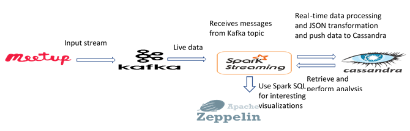

# meetupSparkStreaming
Spark streaming to transform JSON data received from Kafka. Code is written in Scala. 
The bulk data is saved to Cassandra using Spark streaming.
Real-time Streaming analytics involves processing real-time data and analyzing the data to get deeper insights. 
Streaming analytics mainly requires connecting to external data sources which can provide live data, the data from these sources can then be analyzed or we can store the data into external database with processed information. A dashboard or visualization tool can strengthen these insights and make them look more meaningful. Thus, any streaming analytics pipeline is expected to have these components – messaging system, message distribution to different nodes, analytic processing, data storage system, visualization tools.
For this project, the external data source is Meetup RSVP data. 

Meetup.com is an online social networking website which facilitates group meetings around the world. Users can RSVP to their choice of group with a response of “yes” or ‘No”. These RSVPs can be obtained using Meetup live stream API. 
The data can be extracted in the form of JSON through web socket.
  
The pipeline constructed for this analysis task is as follows:
1) The data is collected through websockets. 
2) Kafka is then used as a messaging system which includes a producer that transmits the RSVP messages to consumer and the consumer that receives these messages. 
3) Spark streaming is used to obtain live data from Kafka and transform the JSON messages into a Cassandra storable format. 
4) Spark streaming pushes the transformed data into Cassandra table. 
5) Spark streaming can then be used to analyze this data and find out details like the number of events in different states in US, find out popular events based on RSVPs etc. 
6) Zeppelin Notebook is used to visualize the statistical analysis.

<h1>Analytics pipeline</h1>

  
